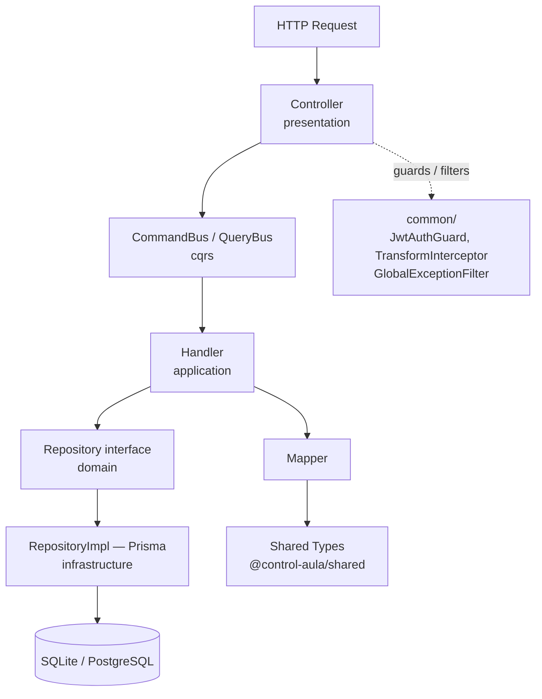
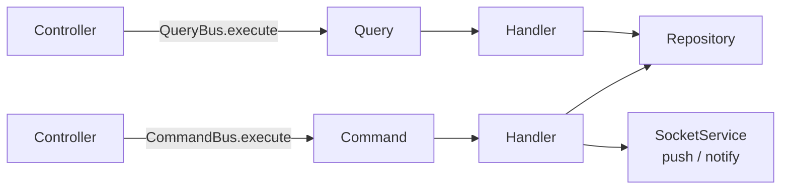

# Arquitectura

## Stack tecnológico

| Capa | Tecnología |
|------|-----------|
| Backend | NestJS 10, TypeScript, Prisma ORM |
| Frontend | Next.js 14 (App Router), React 18, Tailwind CSS |
| Base de datos | SQLite (dev) / PostgreSQL (prod) |
| Tiempo real | WebSocket nativo (`@nestjs/platform-ws`) |
| Autenticación | JWT con cookie HttpOnly (`cbt_session`) |
| Push | Web Push API + VAPID |
| Tipos compartidos | `@control-aula/shared` (npm workspace) |

## Estructura del monorepo

```
cbt-control-aula/
├── shared/          @control-aula/shared  — tipos TypeScript compartidos
├── api/             @control-aula/api     — NestJS, puerto 4001
├── web/             @control-aula/web     — Next.js + servidor custom, puerto 3001
├── nginx/           — configuración Nginx de referencia (uso local/manual)
├── docs/            — esta carpeta
└── docker-compose.yml
```

La raíz gestiona los tres workspaces con `npm workspaces`. El orden de compilación es `shared → api` y `shared → web`.

---

## Capas del API



| Capa | Directorio | Responsabilidad |
|------|-----------|----------------|
| Presentación | `modules/[x]/[x].controller.ts` | Valida input, delega al CommandBus o QueryBus |
| Aplicación | `modules/[x]/application/` | Commands, Queries, Handlers, Mappers |
| Dominio | `modules/[x]/domain/` | Entidades e interfaces de repositorio |
| Infraestructura | `modules/[x]/infrastructure/` | Implementaciones Prisma de repositorios |
| Común | `common/` | Guards, filters, interceptors, decorators |
| WebSocket | `infrastructure/socket/` | Gateway, Service, definición de eventos |

---

## CQRS

Sin event sourcing ni event bus externo. Solo `CommandBus` y `QueryBus` de `@nestjs/cqrs`. Command y Handler conviven en el mismo archivo para reducir dispersión.



```typescript
// Escritura — command + handler en el mismo archivo
export class AwardCoinsCommand {
  constructor(public readonly dto: AwardCoinInput) {}
}

@CommandHandler(AwardCoinsCommand)
export class AwardCoinsHandler implements ICommandHandler<AwardCoinsCommand> {
  constructor(
    private readonly points: PointRepository,
    private readonly sockets: SocketService,
  ) {}

  async execute({ dto }: AwardCoinsCommand) {
    const log = await this.points.award(dto)          // $transaction atómica
    this.sockets.coinsUpdated({ courseId: dto.courseId, ... })
    return log
  }
}
```

---

## Formato de respuesta estándar

`TransformInterceptor` (registrado como `APP_INTERCEPTOR`) envuelve automáticamente toda respuesta exitosa:

```json
{
  "code": 200,
  "status": "success",
  "data": { ... },
  "message": "OK"
}
```

`GlobalExceptionFilter` convierte cualquier excepción al mismo formato con el código HTTP correspondiente. En el frontend, `apiFetch<T>(url)` desenvuelve `.data` y lanza un error si `status !== 'success'`.

---

## Paquete shared

Solo tipos TypeScript, sin código de runtime. Se importa en el API (`@control-aula/shared`) y en el frontend (`@control-aula/shared`).

```
shared/src/types/
├── api-response.ts    IApiResponse<T>
├── user.types.ts      UserRole, SessionPayload, UserResponse, UserCreateInput
├── course.types.ts    CourseResponse, CourseDetail, CourseInput
├── student.types.ts   StudentResponse, CoinLogResponse, TramoEntry, AwardCoinInput
├── action.types.ts    ActionResponse, ActionInput
├── reward.types.ts    RewardResponse, RedemptionResponse, RedemptionFullResponse, RewardInput
├── group.types.ts     GroupResponse, GroupMember, GroupInput
└── portal.types.ts    PortalStudentResponse
```

`SessionPayload` se define aquí porque el API (guards, estrategia JWT) y el frontend (middleware Edge Runtime) lo necesitan sin poder hacer imports cruzados.

---

## Módulos del API

```mermaid
graph TD
    APP[AppModule] --> AUTH[AuthModule]
    APP --> COURSE[CourseModule]
    APP --> STUDENT[StudentModule]
    APP --> ACTION[ActionModule]
    APP --> REWARD[RewardModule]
    APP --> GROUP[GroupModule]
    APP --> POINT[PointModule]
    APP --> PORTAL[PortalModule]
    APP --> PUSH[PushModule]
    APP --> INBOX[InboxModule]
    APP --> BACKUP[BackupModule]
    APP --> SOCKET[SocketModule\nGlobal]
    APP --> PRISMA[PrismaModule\nGlobal]

    POINT --> SOCKET
    REWARD --> SOCKET
    STUDENT --> SOCKET
    PUSH --> SOCKET
