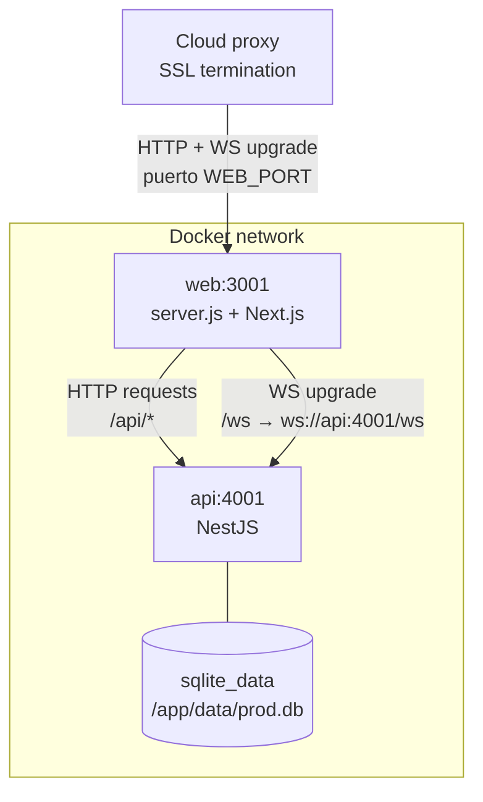
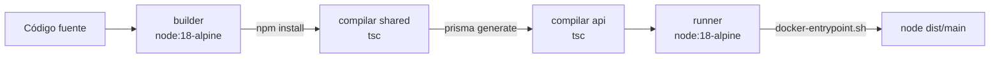
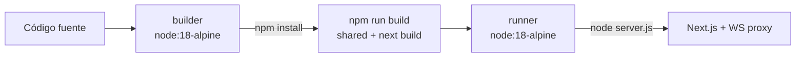

# Docker

## Arquitectura de contenedores



- **`web`** es el único contenedor con puerto expuesto al host (`${WEB_PORT:-3001}:3001`).
- **`api`** solo es accesible dentro de la red Docker (`expose: 4001`). El browser nunca llega directamente al API.
- **No hay contenedor nginx** en el compose — el cloud ya tiene su propio proxy en el puerto 80/443. Añadir otro nginx causaría conflicto de puertos.
- `server.js` hace el rol de proxy WebSocket: captura el evento `upgrade` del HTTP server y tuneliza el socket TCP al API interno.

---

## docker-compose.yml

```yaml
services:
  api:
    build: { context: ., dockerfile: api/Dockerfile }
    expose: ["4001"]                        # solo red interna
    env_file: ./api/.env
    environment:
      - NODE_ENV=production
      - DATABASE_URL=file:/app/data/prod.db
      - PORT=4001
      - WEB_ORIGIN=https://tu-dominio.com
    volumes:
      - sqlite_data:/app/data
    restart: unless-stopped
    healthcheck:
      test: ["CMD", "wget", "-qO-", "http://localhost:4001/api/health"]
      interval: 30s
      timeout: 10s
      retries: 3
      start_period: 30s

  web:
    build:
      context: .
      dockerfile: web/Dockerfile
      args: [API_URL=http://api:4001]
    ports:
      - "${WEB_PORT:-3001}:3001"           # expuesto al host
    environment:
      - NODE_ENV=production
      - API_URL=http://api:4001
    depends_on:
      api: { condition: service_healthy }
    restart: unless-stopped

volumes:
  sqlite_data:
```

---

## Variables de entorno

### API (`api/.env`)

| Variable | Requerida | Descripción |
|----------|-----------|-------------|
| `DATABASE_URL` | ✅ | `file:/app/data/prod.db` (SQLite) o cadena PostgreSQL |
| `JWT_SECRET` | ✅ | Secreto para firmar tokens JWT — **cambiar en producción** |
| `WEB_ORIGIN` | ✅ | URL pública del frontend (CORS + WebSocket) |
| `PORT` | — | Puerto del API (default 4001) |
| `VAPID_PUBLIC_KEY` | ✅ | Clave pública VAPID para Web Push |
| `VAPID_PRIVATE_KEY` | ✅ | Clave privada VAPID para Web Push |
| `VAPID_SUBJECT` | ✅ | Email de contacto (`mailto:admin@example.com`) |

### Web (build args y entorno)

| Variable | Etapa | Descripción |
|----------|-------|-------------|
| `API_URL` | build + runtime | URL interna del API (`http://api:4001`) |
| `NEXT_PUBLIC_API_URL` | build | URL pública del API (se hornea en el bundle) |
| `WEB_PORT` | host | Puerto expuesto al cloud (default 3001) |

Para generar claves VAPID:
```bash
npx web-push generate-vapid-keys
```

---

## Dockerfiles

### api/Dockerfile



- Multi-stage: `builder` compila TypeScript, `runner` solo tiene los archivos necesarios
- `docker-entrypoint.sh` ejecuta migraciones y seed antes de arrancar

### web/Dockerfile



- `server.js` se copia al runner — es el punto de entrada en lugar de `next start`
- El build hornea `API_URL` y `NEXT_PUBLIC_API_URL` como build args

---

## Comandos

```bash
# Construir y levantar todo
docker compose up --build

# Producción en background
docker compose up -d --build

# Ver logs en tiempo real
docker compose logs -f api
docker compose logs -f web

# Reiniciar solo un servicio
docker compose restart api

# Ver estado de contenedores
docker compose ps

# Acceder a la BD con Prisma Studio (solo en dev)
docker compose exec api npm run db:studio

# Limpiar volúmenes (⚠ elimina la BD)
docker compose down -v
```

---

## Persistencia

La BD SQLite se guarda en el volumen `sqlite_data`, montado en `/app/data/prod.db` dentro del contenedor API. El volumen persiste entre `docker compose down` / `up` y entre redespliegues con `--build`.

Para migrar a PostgreSQL en producción:
1. Cambiar `provider = "postgresql"` en `api/prisma/schema.prisma`
2. Actualizar `DATABASE_URL` a la cadena de conexión de PostgreSQL
3. Reemplazar `db push` por `prisma migrate deploy` en `docker-entrypoint.sh`

---

## nginx (referencia local)

El archivo `nginx/nginx.conf` sirve como referencia si se quiere correr Nginx manualmente (sin cloud proxy). No se usa en el docker-compose de producción.

```
location /ws {
  proxy_pass         http://api:4001;
  proxy_http_version 1.1;
  proxy_set_header   Upgrade    $http_upgrade;
  proxy_set_header   Connection "upgrade";
  proxy_read_timeout 86400s;
}
```
