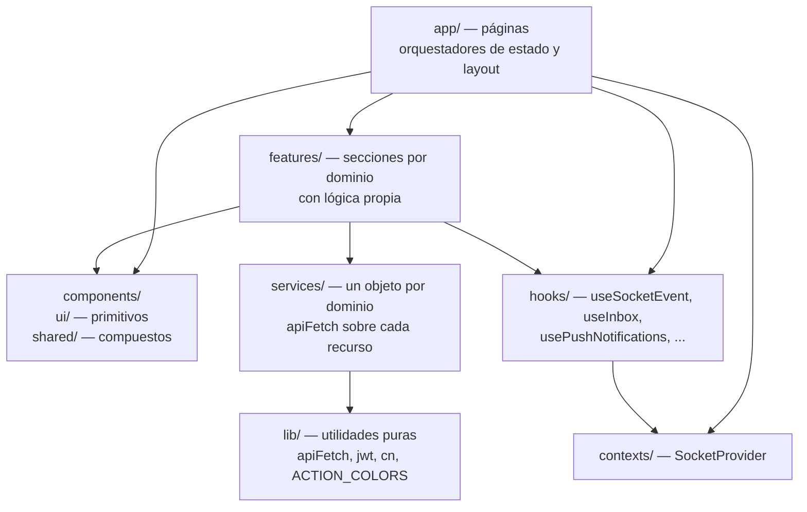
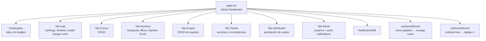
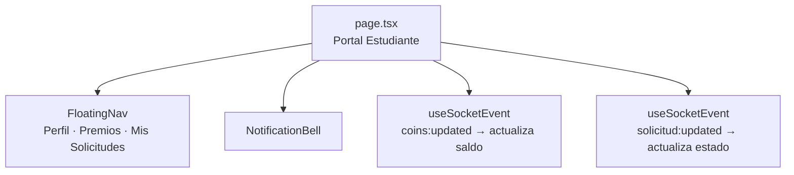
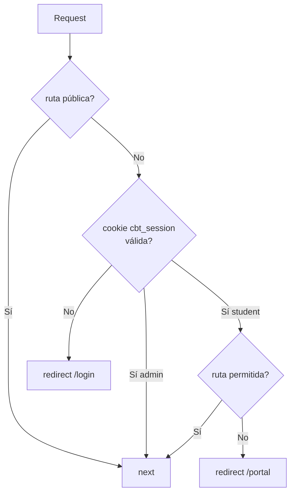

# Frontend

## Stack

| Tecnología | Uso |
|-----------|-----|
| Next.js 14 (App Router) | Framework — SSR, routing, middleware Edge |
| React 18 | UI con hooks y context |
| Tailwind CSS 3 | Estilos utilitarios |
| Lucide React | Iconos |
| XLSX | Importación de Excel |
| `jose` | Verificación de JWT en el Edge Runtime (middleware) |

---

## Estructura de capas



---

## Páginas (`app/`)

### `/login` — Autenticación
Formulario simple. `POST /api/auth/login` → setea cookie `cbt_session` → redirige según rol.

### `/` — Dashboard admin



Carga inicial al montar: todos los cursos, acciones y recompensas. Los estudiantes y grupos se cargan de forma lazy cuando el usuario selecciona un curso.

### `/portal` — Portal del estudiante



---

## Componentes (`components/`)

### `ui/` — Primitivos reutilizables

| Componente | Descripción |
|-----------|-------------|
| `Button` | Variantes: `primary`, `ghost`, `danger`. Soporta `loading` y `disabled`. |
| `Modal` | Modal con overlay. Acepta `title`, `children`, `onClose`. |
| `Input` | Input con label integrado y manejo de error. |
| `Toast` | Notificación temporal (éxito / error). |
| `Skeleton` | Placeholder de carga animado. |
| `Badge` | Pill de contador numérico. |
| `Slider` | Doble slider de rango (usado en filtro de coins). |

### `shared/` — Compuestos de sección

| Componente | Descripción |
|-----------|-------------|
| `SectionHeader` | Barra de herramientas: icono + título + subtítulo + búsqueda + filtros + acciones. Altura `h-8` consistente. |
| `FloatingNav` | Barra de navegación tipo pill flotante. Acepta tabs con `label`, `icon`, `badge?`. |
| `CourseSelect` | Selector de curso reutilizable. Usado en Aula, Alumnos y Grupos. |
| `Pagination` | Paginación con selector de tamaño de página. Default: 5 ítems. |
| `CardActions` | Botones de editar / eliminar para tarjetas. |

---

## Features (`features/`)

Cada feature es una sección de UI con toda su lógica encapsulada. Se renderizan dentro del tab correspondiente de `page.tsx`.

| Feature | Descripción |
|---------|-------------|
| `aula/` | Dashboard del aula: línea de tiempo de recompensas de clase, ranking de alumnos, modal de otorgar coins (3 pasos). |
| `cursos/` | CRUD de cursos con formulario inline. |
| `estudiantes/` | Tabla de alumnos con búsqueda, filtro por coins, paginación, importación Excel. |
| `grupos/` | CRUD de grupos. Selector de miembros con búsqueda. |
| `tienda/` | Sub-tabs Acciones y Premios. CRUD de cada uno. |
| `solicitudes/` | Lista de solicitudes pendientes/aprobadas/rechazadas. Modal de confirmación de aprobación. |
| `admin/` | Gestión de usuarios del sistema. Configuración de notificaciones push. |
| `notifications/` | `NotificationBell` con panel desplegable, badge de no leídas, push prompt. |

---

## Servicios (`services/`)

Un objeto por dominio que agrupa las llamadas al API. Todos usan `apiFetch<T>()` de `lib/`:

```typescript
// Ejemplo: coursesService
export const coursesService = {
  getAll: ()           => apiFetch<CourseResponse[]>('/api/cursos'),
  create: (dto)        => apiFetch<CourseResponse>('/api/cursos', { method: 'POST', body: dto }),
  update: (id, dto)    => apiFetch<CourseResponse>(`/api/cursos/${id}`, { method: 'PUT', body: dto }),
  remove: (id)         => apiFetch<void>(`/api/cursos/${id}`, { method: 'DELETE' }),
}
```

---

## Hooks (`hooks/`)

| Hook | Descripción |
|------|-------------|
| `useSocketEvent(event, handler, deps?)` | Suscribe a un evento WebSocket. Se desuscribe al desmontar. |
| `useInbox()` | Carga y gestiona notificaciones del inbox (`/api/notifications`). |
| `usePushNotifications()` | Gestiona el ciclo de vida de suscripción Web Push. |

---

## Protección de rutas (`middleware.ts`)

Corre en el Edge Runtime de Next.js antes de servir cualquier página o ruta de API:



**Rutas permitidas para `student`:** `/portal`, `/api/portal/*`, `/api/auth/*`, `/api/notifications`, `/api/push`.

**Excluida del matcher:** `/ws` — el upgrade WebSocket lo intercepta `server.js` a nivel de Node.js, nunca llega al middleware de Next.js.

---

## Servidor custom (`server.js`)

En producción Next.js normalmente corre con `next start`. Este proyecto usa un servidor Node.js custom para poder interceptar upgrades WebSocket:

```javascript
const server = createServer((req, res) => handle(req, res, parse(req.url, true)))

server.on('upgrade', (req, socket, head) => {
  // Proxifica el socket TCP directamente al API — sin que Next.js lo vea
  proxy.ws(req, socket, head)
})
```

Tanto `npm run dev` como `npm run start` ejecutan `node server.js`. La diferencia es que en dev Next.js corre en modo de desarrollo (HMR activo).
