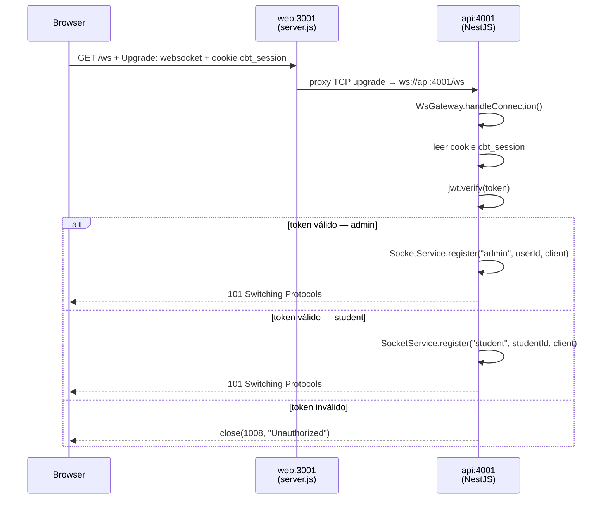
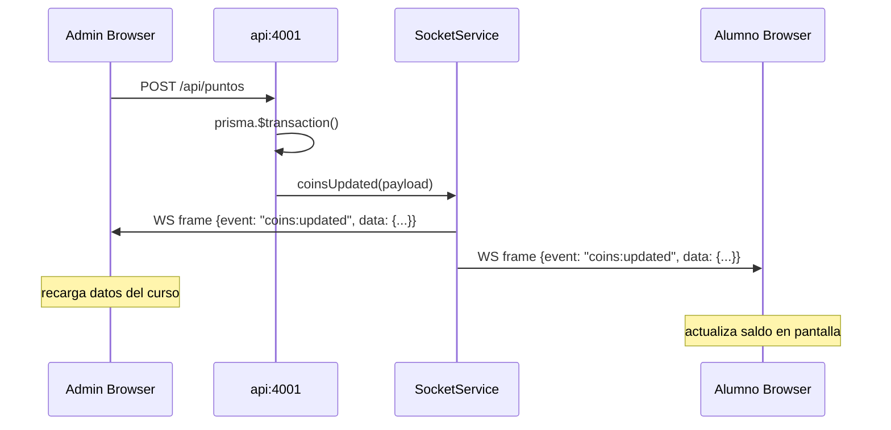
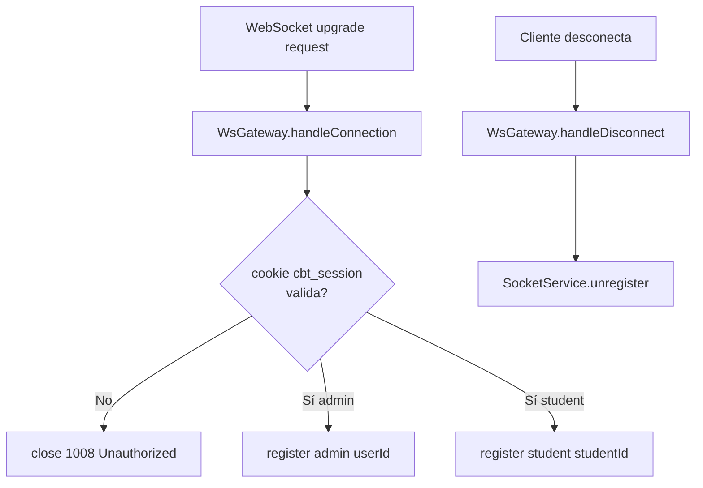
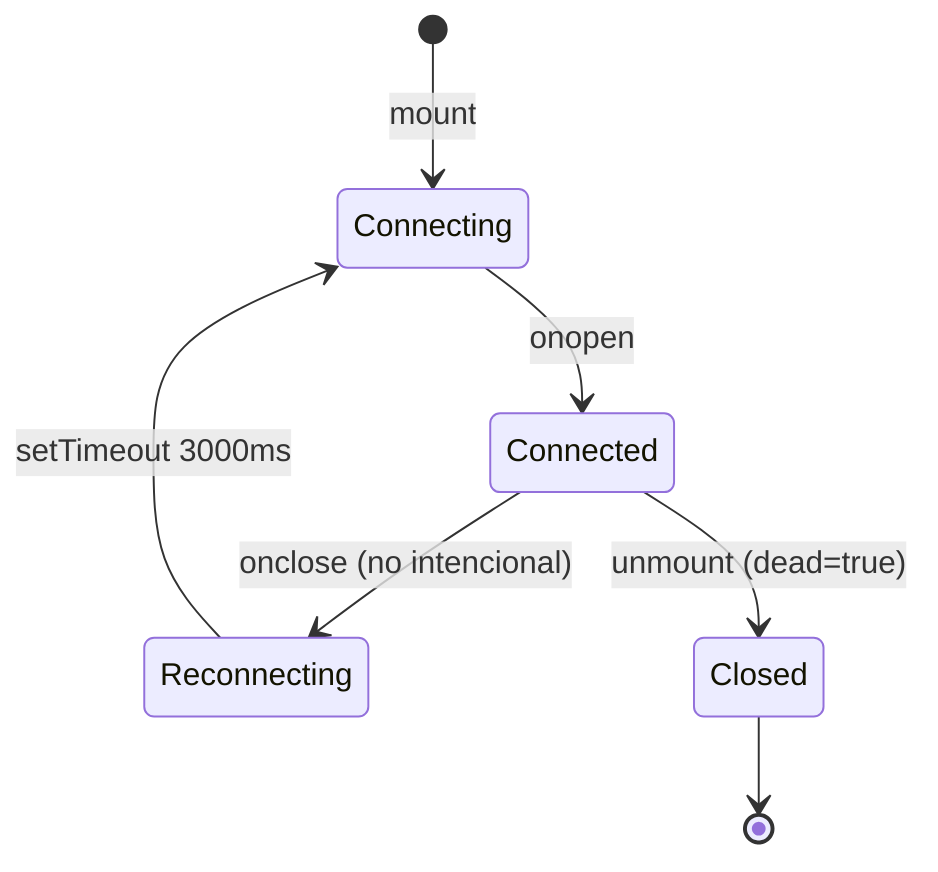

# WebSocket — Tiempo real

## Flujo de conexión



## Flujo de evento (ejemplo: otorgar coins)



## Eventos disponibles

| Evento | Constante | Quién lo recibe | Disparado desde |
|--------|-----------|-----------------|-----------------|
| `coins:updated` | `WS.COINS_UPDATED` | Admins + alumno específico | `AwardCoinsHandler`, `ProcessRedemptionHandler`, `UpdateStudentHandler` |
| `solicitud:new` | `WS.SOLICITUD_NEW` | Todos los admins | `PortalController` (POST solicitar) |
| `solicitud:updated` | `WS.SOLICITUD_UPDATED` | Alumno específico | `ProcessRedemptionHandler` |
| `notification:new` | `WS.NOTIFICATION_NEW` | Admin o alumno | `NotificationService` |

---

## Componentes del API

### WsGateway (`infrastructure/socket/ws.gateway.ts`)



- Decorado con `@WebSocketGateway({ path: '/ws' })` — comparte el puerto HTTP 4001 con el REST API
- Usa `@nestjs/platform-ws` (WebSocket nativo, sin socket.io)
- La autenticación ocurre **una sola vez** en el handshake, no en cada mensaje

### SocketService (`infrastructure/socket/socket.service.ts`)

Mantiene dos `Map<id, Set<WebSocket>>` para soportar múltiples pestañas por usuario:

```typescript
private readonly admins   = new Map<string, Set<WebSocket>>()  // userId    → pestañas
private readonly students = new Map<string, Set<WebSocket>>()  // studentId → pestañas
private readonly meta     = new Map<WebSocket, { map, id }>()  // para cleanup O(1)
```

**Métodos públicos:**

| Método | Destino del frame |
|--------|------------------|
| `coinsUpdated(payload)` | Todos los admins + alumno identificado en `payload.studentId` |
| `solicitudNew(payload)` | Todos los admins |
| `solicitudUpdated(studentId, payload)` | Alumno específico |
| `notificationForStudent(studentId, payload)` | Alumno específico |
| `notificationForAdmins(payload)` | Todos los admins |

El frame enviado tiene la forma `{ event: string, data: unknown }` serializado como JSON.

---

## Componentes del Frontend

### server.js (raíz de `web/`)

Next.js en modo `next start` no maneja WebSocket. `server.js` crea el servidor HTTP de Node.js manualmente y escucha el evento `upgrade` antes de que Next.js procese nada:

```javascript
const server = createServer((req, res) => handle(req, res, parse(req.url, true)))

server.on('upgrade', (req, socket, head) => {
  // tuneliza el socket TCP directamente al API interno
  proxy.ws(req, socket, head)   // target: http://api:4001
})
```

En producción Docker, el cloud proxy envía el upgrade WebSocket al container web. `server.js` lo recibe y lo reenvía al API interno (inaccesible desde el exterior).

### SocketProvider (`contexts/SocketContext.tsx`)



- Expone `useWs()` → `{ on(event, handler) → () => void }`
- Los listeners se almacenan en un `useRef<Map>` — no causan re-renders

### useSocketEvent (`hooks/useSocketEvent.ts`)

Hook tipado que se suscribe al montar y se desuscribe al desmontar:

```typescript
// En el portal del alumno
useSocketEvent(WS.COINS_UPDATED, ({ studentId, studentCoins }) => {
  if (studentId) setStudent(s => s ? { ...s, coins: studentCoins } : s)
})

// En el dashboard admin
useSocketEvent(WS.SOLICITUD_NEW, () => {
  setPendingSolicitudes(n => n + 1)
})
```

### ws/events.ts

Espejo frontend de `socket.events.ts` del API. Si se agrega un evento en el API, actualizarlo aquí también.

```typescript
export const WS = {
  COINS_UPDATED:     'coins:updated',
  SOLICITUD_NEW:     'solicitud:new',
  SOLICITUD_UPDATED: 'solicitud:updated',
  NOTIFICATION_NEW:  'notification:new',
} as const

export type WsEvent = typeof WS[keyof typeof WS]

export interface WsPayloads {
  'coins:updated':     { courseId: string; classCoins?: number; studentId?: string; studentCoins?: number }
  'solicitud:new':     { id: string; studentName: string; rewardName: string }
  'solicitud:updated': { id: string; status: string }
  'notification:new':  { id: string; title: string; body: string; createdAt: string }
}
```

---

## Por qué WebSocket nativo y no socket.io

| Aspecto | socket.io | WebSocket nativo |
|---------|-----------|-----------------|
| Transporte | HTTP polling + upgrade opcional | Solo WS upgrade (estándar HTTP) |
| Requests en silencio | Muchas (polling) | Cero |
| Compatibilidad con cloud proxies | Requiere config específica para `/socket.io/*` | Funciona con cualquier proxy moderno |
| Dependencias | `socket.io` + `socket.io-client` | Ninguna extra en el browser |
| Autenticación | Handshake propio | Cookie HTTP nativa en el upgrade |
